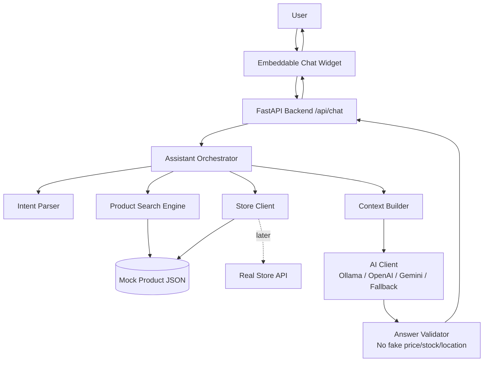

# AI Store Assistant Chatbot

Production-oriented MVP: a **FastAPI** backend plus an **embeddable vanilla JS** widget that answers car-related questions using **verified mock catalog data**, optional **LLM** providers, and **validation** so prices/stock/locations are not invented.

## Architecture (overview)



Full platform-style diagrams (tools, RAG, validation layers) live in [`docs/architecture.md`](docs/architecture.md).

## Features

- Mongolian-first replies with English keywords supported in intent parsing.
- Embeddable widget: minimalist layout; drag the header to move; resize handle bottom-right; minimize (−), maximize (□), close (×); **A− / A+** adjusts text size (saved locally).
- Mock catalog (`backend/data/products.json`) with compatibility, symptoms, pricing, stock, shelf location.
- Product ranking by car/symptom/category/keywords/stock.
- Pluggable AI: **Ollama → OpenAI → Gemini → rule-based fallback**.
- Answer validation against returned product cards.
- CORS from env, message length limits, no stack traces to clients.

## Security (API keys)

- **LLM and store secrets** live only in `backend/.env` (or your host secret manager). The browser never receives them.
- The widget may expose **`window.AI_STORE_ASSISTANT_API`** — that must be only your **public** backend base URL (not an OpenAI/Gemini key).

## How to run

### Windows (PowerShell)

```powershell
cd ai-store-assistant-chatbot\backend
Copy-Item .env.example .env
python -m pip install -r requirements.txt
python -m uvicorn app.main:app --reload --host 127.0.0.1 --port 8000
```

### macOS / Linux

```bash
cd ai-store-assistant-chatbot/backend
cp .env.example .env
python3 -m pip install -r requirements.txt
python3 -m uvicorn app.main:app --reload --host 127.0.0.1 --port 8000
```

Open `http://127.0.0.1:8000/widget/index.html`.

### Without any AI provider

Leave **`OLLAMA_BASE_URL`**, **`OPENAI_API_KEY`**, and **`GEMINI_API_KEY`** empty in `.env`. `/api/chat` uses the Mongolian templates in `app/response_builder.py`.

## Setup

### 1. Backend

```powershell
cd backend
copy .env.example .env
python -m pip install -r requirements.txt
python -m uvicorn app.main:app --reload --host 127.0.0.1 --port 8000
```

Open:

- API root: `http://127.0.0.1:8000`
- Swagger: `http://127.0.0.1:8000/docs`
- Widget (served by backend): `http://127.0.0.1:8000/widget/index.html`

### 2. Frontend only

Serve `frontend/` from any static server **or** rely on FastAPI’s `/widget` mount when `frontend/` exists next to `backend/`.

If you open `index.html` from disk (`file://`), set the API base **before** `widget.js` loads:

```html
<script>window.AI_STORE_ASSISTANT_API = 'http://127.0.0.1:8000';</script>
```

### 3. Docker

From project root:

```powershell
docker compose up --build
```

The compose file mounts `./frontend` to `/frontend` and sets `FRONTEND_STATIC_PATH=/frontend` so `/widget` works in the container.

## Environment variables

See `backend/.env.example`. Important keys:

| Variable | Purpose |
| -------- | ------- |
| `CORS_ORIGINS` | Comma-separated browser origins allowed to call the API |
| `STORE_PROVIDER` | `mock` (default) or `rest` (stub until integrated) |
| `OLLAMA_BASE_URL`, `OLLAMA_MODEL` | Local Ollama (`http://127.0.0.1:11434`) |
| `OPENAI_API_KEY`, `OPENAI_MODEL` | OpenAI Chat Completions |
| `GEMINI_API_KEY`, `GEMINI_MODEL` | Google Generative Language API |
| `FRONTEND_STATIC_PATH` | Optional absolute path for widget files (Docker) |

**Never** put provider keys in the frontend; only the backend reads them.

## Example API calls

```powershell
curl -s http://127.0.0.1:8000/health

curl -s -X POST http://127.0.0.1:8000/api/chat `
  -H "Content-Type: application/json" `
  -d "{\"message\":\"Prius 30 асахгүй байна\",\"lang\":\"mn\"}"
```

More examples: [`docs/api.md`](docs/api.md).

## Connecting a real store API

Replace `MockStoreClient` usage by implementing `RestStoreClient` HTTP calls and setting `STORE_PROVIDER=rest`. Details: [`docs/store-api-integration.md`](docs/store-api-integration.md).

**Where mock data is loaded:** `backend/data/products.json` (and aliases/symptom maps). Swap the store adapter to point at your ERP/e-commerce API while keeping the same orchestration flow.

## Ollama (local, free)

1. Install [Ollama](https://ollama.com/) and pull a model, e.g. `ollama pull llama3.2`.
2. In `backend/.env`:

```env
OLLAMA_BASE_URL=http://127.0.0.1:11434
OLLAMA_MODEL=llama3.2
```

3. Restart the backend. If Ollama is unreachable, the service falls back to templates.

## OpenAI / Gemini

Set `OPENAI_API_KEY` or `GEMINI_API_KEY` in `backend/.env` only. Provider order: **Ollama → OpenAI → Gemini → fallback**.

## Tests

```powershell
cd backend
python -m pytest -q
```

## Future improvements

- Replace keyword search internals with embeddings + vector DB (`ProductSearchEngine` seam).
- Wire real inventory / POS / PIM via `RestStoreClient`.
- Strong rate limiting (Redis / API gateway) and auth for production widgets.
- Streaming responses and WebSockets for lower latency.

## Documentation

- [`docs/architecture.md`](docs/architecture.md) — full system & runtime diagrams (Mermaid).
- [`docs/api.md`](docs/api.md) — endpoints and payloads.
- [`docs/store-api-integration.md`](docs/store-api-integration.md) — moving from JSON mock to REST.

## Project layout

```text
ai-store-assistant-chatbot/
├─ backend/
│  ├─ app/
│  ├─ data/
│  ├─ tests/
│  ├─ Dockerfile
│  ├─ requirements.txt
│  └─ .env.example
├─ frontend/
├─ docs/
├─ README.md
└─ docker-compose.yml
```

## Example chat scenarios

See **Summary for the user** section in your IDE after generation — three sample user messages and expected assistant behaviors are listed there.
