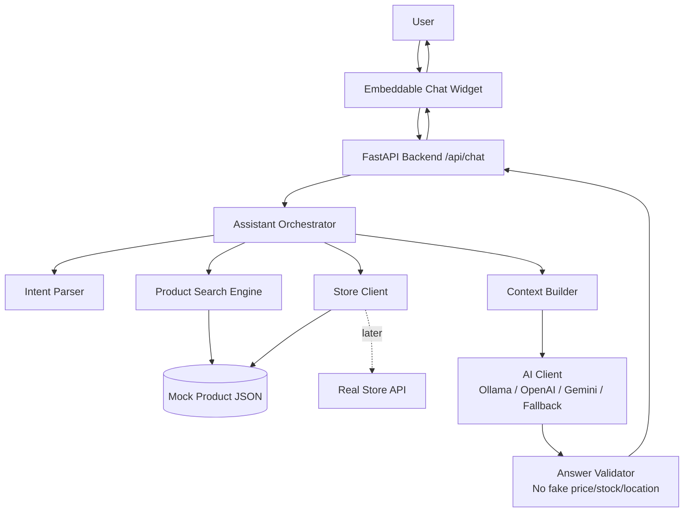

<div align="center">

# AI Store Assistant Chatbot

### Production-oriented AI chatbot for small online stores

A **FastAPI backend** plus an **embeddable vanilla JavaScript widget** that answers store/customer questions using verified catalog data, optional LLM providers, and validation so prices, stock, and locations are not invented.

<br/>


</div>

---

## The Problem

Small online stores often receive repeated customer questions:

| Customer Question | Store Problem |
|---|---|
| “Do you have this product?” | Staff must manually check catalog or stock |
| “How much is it?” | Customers need fast and accurate price answers |
| “Where is it located?” | Store shelf/location info should not be guessed |
| “Is it in stock?” | AI must not invent availability |
| “Can I order now?” | Customers expect fast responses |

Generic AI chatbots can sound confident but may invent fake prices, fake stock, or fake locations.

This project explores how to make a small-store AI assistant more useful and safer by grounding answers in verified product data.

---

## The Solution

AI Store Assistant Chatbot is a production-oriented MVP for store support.

It combines:

- an embeddable frontend chat widget
- a FastAPI backend
- product search over mock catalog data
- intent parsing
- context building
- optional LLM providers
- rule-based fallback
- answer validation

The goal is not just to make an AI chatbot answer questions, but to make it answer using real catalog information.

---

## Core Architecture



Full platform-style diagrams are available in:

```text
docs/architecture.md
```

---

## Why I Built It

I wanted to build an AI project that feels closer to a real product, not just a simple chatbot demo.

Many small online stores in Mongolia and other countries sell through small websites, Facebook pages, or simple online catalogs. They often do not have large technical teams or full-time customer support.

So I wanted to explore this question:

> Can a small store use a simple AI assistant that answers customer questions based on real product data, while avoiding fake or unsupported information?

This project helped me learn that useful AI applications need more than an LLM. They need backend logic, data grounding, validation, fallback behavior, security boundaries, and user experience design.

---

## Features

| Feature | Description |
|---|---|
| Mongolian-first replies | Replies are optimized for Mongolian, while English keywords are supported in intent parsing |
| Embeddable widget | Minimalist vanilla JS widget for store websites |
| Movable UI | Drag header, resize bottom-right, minimize, maximize, and close |
| Text size controls | A− / A+ adjusts text size and saves locally |
| Mock product catalog | Uses `backend/data/products.json` with compatibility, symptoms, pricing, stock, and shelf location |
| Product ranking | Ranks products by car, symptom, category, keywords, and stock |
| Pluggable AI providers | Ollama → OpenAI → Gemini → rule-based fallback |
| Answer validation | Checks returned answer against product cards to avoid fake price, stock, or location |
| Safe API design | API keys stay in backend `.env`, never in browser |
| CORS control | CORS origins are configured from environment variables |
| Message limits | Limits message length and avoids leaking stack traces to clients |
| Docker support | Can run through Docker Compose |

---

## What Makes It Different

This project is not only:

```text
User message → AI answer
```

It follows a safer AI product flow:

```text
User message
    ↓
Intent parsing
    ↓
Product search
    ↓
Verified catalog context
    ↓
AI or fallback response
    ↓
Answer validation
    ↓
Safe customer response
```

That makes it more realistic for store/customer support use cases.

---

## System Design

| Layer | Responsibility |
|---|---|
| Widget | Customer-facing chat interface |
| API | Receives chat requests and returns assistant responses |
| Assistant Orchestrator | Coordinates intent, search, context, AI, and validation |
| Intent Parser | Detects product/search/support intent from user messages |
| Product Search Engine | Finds relevant products from mock catalog data |
| Store Client | Reads mock product data now, can later connect to real store APIs |
| Context Builder | Builds grounded context for the assistant |
| AI Client | Uses Ollama, OpenAI, Gemini, or fallback templates |
| Answer Validator | Prevents unsupported price, stock, and location claims |
| Fallback Builder | Returns safe Mongolian template answers if no AI provider is available |

---

## AI Provider Flow

Provider order:

```text
Ollama → OpenAI → Gemini → Rule-based fallback
```

This means:

| Provider | Purpose |
|---|---|
| Ollama | Local/free model support |
| OpenAI | Optional hosted LLM provider |
| Gemini | Optional hosted LLM provider |
| Rule-based fallback | Safe response templates when AI is unavailable |

The assistant can still work without any AI API key by using fallback Mongolian templates.

---

## Security: API Keys

LLM and store secrets must live only in:

```text
backend/.env
```

or in the host secret manager.

The browser must never receive OpenAI, Gemini, Ollama, or store provider secrets.

The widget may expose:

```js
window.AI_STORE_ASSISTANT_API
```

but this should only be the public backend base URL, not a secret key.

---

## Example Use Cases

| User asks | Assistant should do |
|---|---|
| “Prius 30 асахгүй байна” | Detect car/symptom intent and search matching products |
| “Энэ хэд вэ?” | Answer using real catalog price if available |
| “Байгаа юу?” | Use stock information from product data |
| “Хаана байгаа вэ?” | Use verified shelf/location data only |
| “Өөр төстэй юм байна уу?” | Suggest relevant alternatives from catalog |
| “Хямдруулж болох уу?” | Avoid inventing unsupported discount policies |

---

## Project Structure

```text
ai-store-assistant-chatbot/
├─ backend/
│  ├─ app/
│  │  ├─ main.py
│  │  ├─ response_builder.py
│  │  └─ ...
│  ├─ data/
│  │  └─ products.json
│  ├─ tests/
│  ├─ Dockerfile
│  ├─ requirements.txt
│  └─ .env.example
├─ frontend/
│  └─ widget files
├─ docs/
│  ├─ architecture.md
│  ├─ api.md
│  └─ store-api-integration.md
├─ README.md
└─ docker-compose.yml
```

---

## How to Run

### Windows PowerShell

```powershell
cd ai-store-assistant-chatbot\backend
Copy-Item .env.example .env
python -m pip install -r requirements.txt
python -m uvicorn app.main:app --reload --host 127.0.0.1 --port 8000
```

Open:

```text
http://127.0.0.1:8000/widget/index.html
```

---

### macOS / Linux

```bash
cd ai-store-assistant-chatbot/backend
cp .env.example .env
python3 -m pip install -r requirements.txt
python3 -m uvicorn app.main:app --reload --host 127.0.0.1 --port 8000
```

Open:

```text
http://127.0.0.1:8000/widget/index.html
```

---

## Backend Setup

```bash
cd backend
cp .env.example .env
python -m pip install -r requirements.txt
python -m uvicorn app.main:app --reload --host 127.0.0.1 --port 8000
```

Useful local URLs:

| URL | Purpose |
|---|---|
| `http://127.0.0.1:8000` | API root |
| `http://127.0.0.1:8000/docs` | Swagger docs |
| `http://127.0.0.1:8000/widget/index.html` | Widget demo |

---

## Frontend Widget

The widget can be served from the backend using FastAPI’s `/widget` mount.

If opening the frontend from disk using `file://`, set the backend API before `widget.js` loads:

```html
<script>
  window.AI_STORE_ASSISTANT_API = "http://127.0.0.1:8000";
</script>
```

---

## Docker

From project root:

```bash
docker compose up --build
```

The compose file mounts:

```text
./frontend → /frontend
```

and sets:

```text
FRONTEND_STATIC_PATH=/frontend
```

so `/widget` works inside the container.

---

## Environment Variables

See:

```text
backend/.env.example
```

Important variables:

| Variable | Purpose |
|---|---|
| `CORS_ORIGINS` | Comma-separated browser origins allowed to call the API |
| `STORE_PROVIDER` | `mock` by default, `rest` later |
| `OLLAMA_BASE_URL` | Local Ollama base URL |
| `OLLAMA_MODEL` | Ollama model name |
| `OPENAI_API_KEY` | OpenAI API key |
| `OPENAI_MODEL` | OpenAI model name |
| `GEMINI_API_KEY` | Gemini API key |
| `GEMINI_MODEL` | Gemini model name |
| `FRONTEND_STATIC_PATH` | Optional absolute path for widget files |

Never put provider keys in the frontend.

---

## Run Without Any AI Provider

Leave these empty in `.env`:

```env
OLLAMA_BASE_URL=
OPENAI_API_KEY=
GEMINI_API_KEY=
```

Then `/api/chat` uses Mongolian rule-based templates from:

```text
app/response_builder.py
```

---

## Example API Calls

Health check:

```bash
curl -s http://127.0.0.1:8000/health
```

Chat request:

```bash
curl -s -X POST http://127.0.0.1:8000/api/chat \
  -H "Content-Type: application/json" \
  -d '{"message":"Prius 30 асахгүй байна","lang":"mn"}'
```

More examples:

```text
docs/api.md
```

---

## Connecting a Real Store API

Right now, the project uses mock catalog data from:

```text
backend/data/products.json
```

To connect a real store API:

1. Implement `RestStoreClient`.
2. Replace or extend `MockStoreClient`.
3. Set:

```env
STORE_PROVIDER=rest
```

4. Keep the same orchestration flow.

More details:

```text
docs/store-api-integration.md
```

---

## Ollama Setup

1. Install Ollama.
2. Pull a model:

```bash
ollama pull llama3.2
```

3. Add this to `backend/.env`:

```env
OLLAMA_BASE_URL=http://127.0.0.1:11434
OLLAMA_MODEL=llama3.2
```

4. Restart the backend.

If Ollama is unreachable, the service falls back to templates.

---

## OpenAI / Gemini Setup

Set either:

```env
OPENAI_API_KEY=your_key_here
```

or:

```env
GEMINI_API_KEY=your_key_here
```

Only the backend reads these keys.

Provider order:

```text
Ollama → OpenAI → Gemini → Fallback
```

---

## Tests

```bash
cd backend
python -m pytest -q
```

---

## Demo Flow for Reviewers

Recommended 45–60 second demo:

| Time | What to show |
|---|---|
| 0–10 sec | Explain the problem: small stores need fast support |
| 10–20 sec | Show the embeddable widget |
| 20–35 sec | Ask a product/car-related question |
| 35–45 sec | Show catalog-grounded answer with product info |
| 45–55 sec | Ask unsupported/fake info question |
| 55–60 sec | Show validation or safe fallback behavior |

---

## What I Learned

While building this project, I learned that useful AI applications are not only about sending prompts to a model.

The hardest parts were:

- grounding answers in real product data
- preventing fake price, stock, and location claims
- designing fallback behavior
- connecting frontend widget logic with backend APIs
- thinking about API key security
- making AI responses safer and more useful
- designing a system that can later connect to a real store API

This project helped me understand that AI products need system design, not just model output.

---

## Current Limitations

| Limitation | Future Fix |
|---|---|
| Mock catalog only | Connect real inventory/POS/PIM API |
| Keyword search | Add embeddings + vector database |
| Basic validation | Add stronger validation rules and tests |
| No admin dashboard | Add product upload and store management UI |
| Limited rate limiting | Add Redis/API gateway rate limiting |
| No streaming yet | Add streaming responses or WebSockets |

---

## Future Improvements

- Replace keyword search with embeddings + vector DB
- Connect real inventory, POS, or PIM through `RestStoreClient`
- Add strong rate limiting with Redis or API gateway
- Add auth for production widgets
- Add streaming responses
- Add WebSocket support for lower latency
- Add admin dashboard
- Add product upload UI
- Add richer Mongolian language support
- Add analytics for store owners
- Add hosted live demo

---

## Documentation

| File | Description |
|---|---|
| `docs/architecture.md` | Full system and runtime diagrams |
| `docs/api.md` | Endpoints and payloads |
| `docs/store-api-integration.md` | Moving from JSON mock to REST store API |

---

## Portfolio Summary

AI Store Assistant Chatbot is a practical AI product prototype for small online stores.

It demonstrates:

- FastAPI backend development
- embeddable widget architecture
- product search and catalog grounding
- LLM provider orchestration
- validation and fallback design
- API key security boundaries
- real-world AI product thinking

This project represents my interest in building AI systems that are useful, safer, and connected to real user problems.

<div align="center">

### AI should not just answer confidently. It should answer responsibly.

</div>
