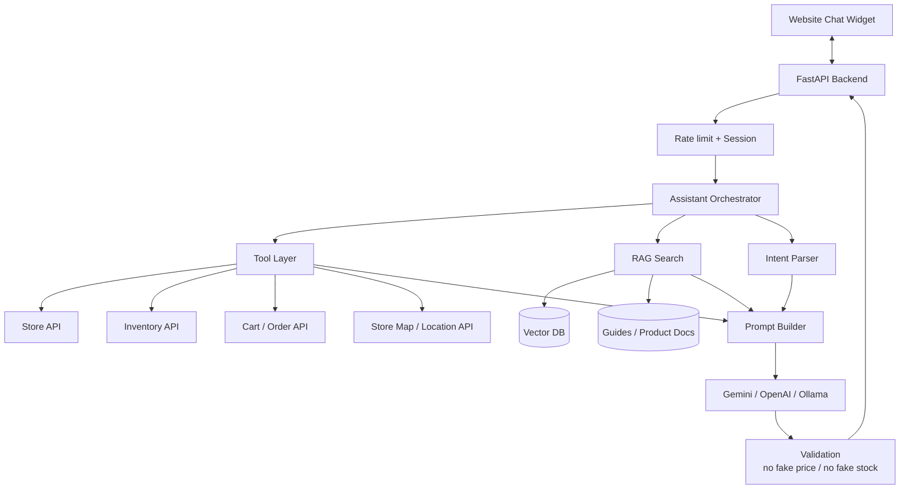
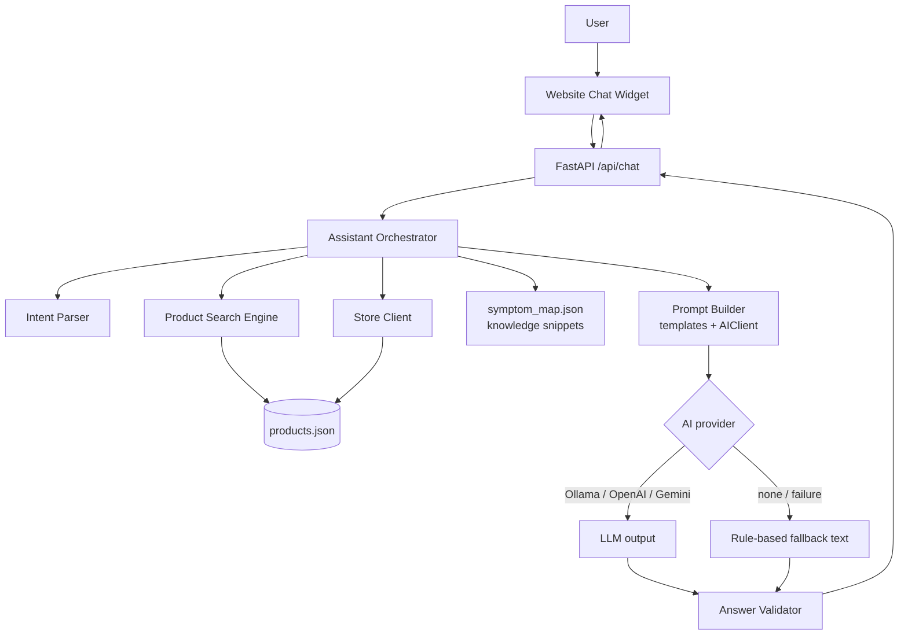
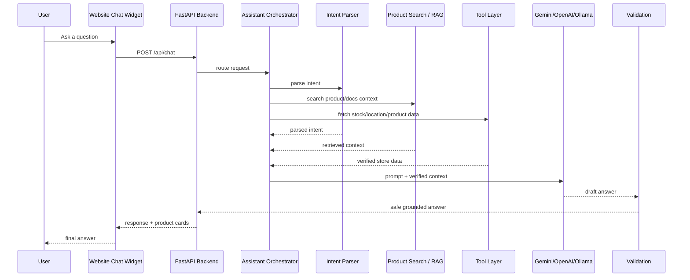

# System architecture

This document describes the **AI Store Assistant** as a small but production-shaped assistant stack: widget → API → orchestration → retrieval/tools → prompt construction → model → validation → response.

---

## 1. Platform-style component diagram

The diagram separates **core backend flow**, **tool integrations**, **retrieval / RAG**, **LLM**, and **validation**.

### What each block does

| Block | Role |
| ----- | ---- |
| **Website Chat Widget** | Embedded UI in the retailer site; sends user text only to **our** backend (no third-party keys in the browser). |
| **FastAPI Backend** | HTTP API, routing, CORS, request validation, static hosting of the widget (optional), error handling without leaking stack traces. |
| **Rate limit + Session** | Abuse protection and session continuity (MVP: documented hook / future Redis or gateway rate limits). |
| **Assistant Orchestrator** | Single workflow coordinator: intent → catalog search → knowledge snippets → AI or fallback → validation → JSON response + product cards. |
| **Intent Parser** | Rule-based extraction of car model, symptom, category, and high-level intent type (diagnose, stock, location, …). |
| **Tool Layer** | Structured integrations that return **authoritative** business data: catalog, stock, price, location, cart/order if enabled later. In the MVP, **MockStoreClient** implements this against JSON; **RestStoreClient** is a typed stub for production HTTP APIs. |
| **RAG Search** | Retrieves unstructured knowledge (guides, symptom explanations). MVP reads `symptom_map.json` and passes snippets into the prompt; the **Vector DB** box represents the future embedding store for manuals and long docs. |
| **Prompt Builder** | Composes user message + parsed intent + verified products + knowledge snippets into one grounded prompt (inside `AIClient` + templates). |
| **Gemini / OpenAI / Ollama** | Pluggable LLM backends; if none are configured or a call fails, **rule-based fallback** runs. |
| **Validation** | Post-check that the assistant text does not claim prices that contradict the verified product list returned for that turn. |

---

## 2. MVP implementation mapping

In this repository, several “future” boxes are **represented lightly** so the architecture stays stable when you scale up:

| Diagram box | Current code |
| ----------- | ------------ |
| Store / Inventory / Location APIs | Unified in **`MockStoreClient`** + `products.json` (price, stock, location fields). |
| Cart / Order API | Not wired; reserved for future checkout deep-links. |
| Vector DB | Not deployed; **`ProductSearchEngine`** is keyword + scoring, ready to swap for embeddings. |
| Guides / Product Docs | **`symptom_map.json`** provides short structured hints used like mini-RAG context. |

---

## 3. Core data-flow diagram (repository-aligned)

---

## 4. Runtime sequence (request lifecycle)

In the MVP, **Search** and **Tools** both resolve against the same verified catalog payload for simplicity; when you add a real commerce stack, **Tools** becomes network I/O while **Search** may remain lexical or move to vectors.

---

## 5. Security and grounding principles

1. **Single source of truth** for numeric facts in a turn: the product rows passed into the prompt and returned as `products` in JSON.
2. **LLMs may narrate** diagnostics; they **must not fabricate** SKU-level facts—prompt rules + validator enforce this at a baseline level.
3. **Secrets never ship to the browser**; only the backend reads AI or store credentials.

---

## 6. Roadmap hooks

- Replace **keyword ranker** with embeddings + **Vector DB** for manuals and long-tail SKUs.
- Split **Tool Layer** into distinct REST clients (pricing vs inventory vs geography) matching your OMS/ERP boundaries.
- Add **proper rate limiting** (e.g. Redis token bucket) and authenticated widget embedding.
